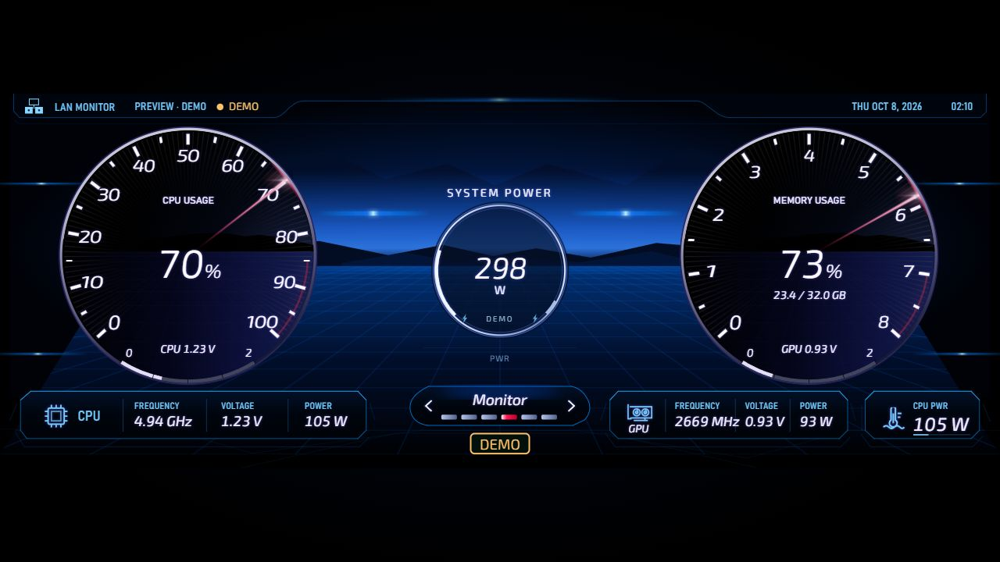
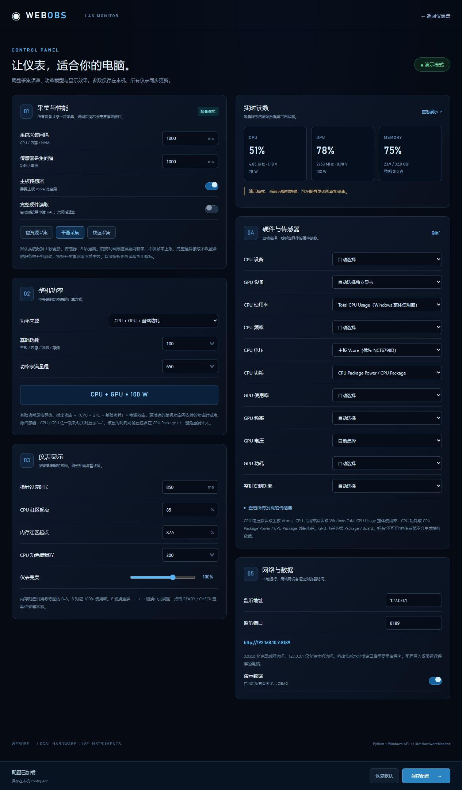

# WebOBS · 局域网电脑仪表盘

把电脑的实时硬件状态变成一块汽车风格的仪表盘。在 Windows 电脑上运行采集服务，用同一局域网内的电脑、平板或手机浏览器查看 CPU、内存、GPU 和功耗。

Python 标准库提供 HTTP / SSE 服务，前端使用原生 HTML、CSS、JavaScript、SVG 与 Canvas；运行无需 Node.js、数据库或前端构建工具。



> 截图来自当前源码的演示模式，标有 **DEMO**，用于说明界面布局，不代表实际硬件读数。配置页截图同样来自演示实例，使用本机端口 8189；正常启动默认使用 8080。

## 功能

- **实时仪表**：CPU 使用率、内存使用率与容量、CPU / GPU 频率、电压、功耗，以及中央整机功率表。
- **局域网多屏**：所有客户端共享一份采集快照，通过 SSE 接收更新；增加显示设备不会重复采样硬件。
- **浏览器控制**：全屏、切换中央视图、查看采集状态，适合横屏平板或副屏常驻显示。
- **可配置数据来源**：自动选择 CPU / GPU，也可绑定具体设备与传感器，配置页显示可用读数和来源。
- **可调功率模型**：CPU + GPU + 基础功耗、考虑电源效率的插座功率估算，或绑定整机功率传感器。
- **本地资源**：字体与静态资源本地提供，无 CDN、在线字体请求或遥测；硬件操作只读取数据。
- **轻量采集**：Windows API、NVIDIA NVML 和小型 .NET 传感器桥接，采集周期与前端动画独立。

## 快速开始

### 方式一：Windows 便携版

如果已有打包版本，解压整个 `WebOBS` 文件夹，运行其中的 `WebOBS.exe`。请保留同目录的 `_internal` 等文件，不能只复制可执行文件。

本工作区现有版本位于 `dist-telemetry-fixed/WebOBS/WebOBS.exe`；已有压缩包包括 `WebOBS-Windows-iPad-Safari-Fix.zip`。这些文件是本地构建产物，不随 Git 仓库提交；最新源码可以按下文重新构建。

便携版无需安装 Python 或 Node.js。启动后访问：

- 仪表盘：[http://localhost:8080/](http://localhost:8080/)
- 配置页：[http://localhost:8080/settings](http://localhost:8080/settings)
- 演示预览：[http://localhost:8080/?demo=1](http://localhost:8080/?demo=1)

终端按 `Ctrl+C` 停止服务。

### 方式二：从源码运行

需要 **Windows 10 / 11 和 Python 3.10+**。基础运行只使用 Python 标准库，无需 `pip install`。

在项目目录打开 PowerShell：

```powershell
python monitor.py
```

也可以双击 `Start-WebOBS.cmd`，它会优先使用 Windows Python Launcher `py`，否则使用 `python`。

未准备硬件库时，Windows / NVIDIA 已支持的基础指标仍可读取；不可用的电压、功耗等显示“—”。要启用更多传感器，先停止服务，再执行：

```powershell
python setup-hardware.py
python build-sensor.py
python monitor.py
```

`setup-hardware.py` 下载固定版本 **LibreHardwareMonitor 0.9.6** 并校验 SHA-256。`build-sensor.py` 使用 Windows 的 .NET Framework 64 位编译器生成 `vendor/WebOBSSensor.exe`；完整桥接需要 .NET Framework 4.7.2+。未编译时可回退到 `sensor-bridge.ps1`，但该回退不提供临时授权采集。

### 完整硬件读取

CPU Package 功耗、主板 Vcore 与精确核心频率通常需要底层传感器访问。默认开启“完整硬件读取”，启动时按需为临时采集进程申请一次 UAC 授权；WebOBS 主程序以普通权限运行。

- 仓库保留官方签名的 PawnIO 2.1.0 驱动及对应源码、许可证；不会运行驱动安装器，也不设置开机启动。
- 附带驱动限 **Intel / AMD x64，Windows 10 2004（19041）及更新版本、Windows 11**；旧版本或 ARM64 不加载该驱动。
- WebOBS 退出后，临时采集进程和它创建的驱动记录会清理；其他软件已有且可访问的驱动保持原有管理方式。
- 取消授权仍能使用已有指标，缺失读数显示“—”，不会反复弹出授权。
- 关闭配置页的“完整硬件读取”并重启，或使用 `--no-elevation`，可禁止本次启动申请授权。

传感器可用性取决于 CPU、显卡和主板，不保证所有设备都能提供电压或功耗。

### 在平板或手机上查看

1. 电脑和显示设备连接同一局域网。
2. 运行 WebOBS，启动窗口会列出电脑的 IPv4 访问地址。
3. 在另一设备的浏览器打开 `http://电脑IP:8080/`，建议横屏使用。

默认监听 `0.0.0.0:8080`。如果 Windows 防火墙阻止访问，请允许程序在专用网络接收连接；程序不会自动修改防火墙。配置写入需在运行服务的电脑上通过 `localhost` 打开配置页。

## 界面与操作

| 位置 | 显示内容 |
| --- | --- |
| 左侧大仪表 | CPU 使用率，0–100% |
| 右侧大仪表 | 内存使用率和已用 / 总容量；0–8 刻度中的 8 对应 100% |
| 中央圆环 | 整机瞬时功率 |
| 左 / 右大仪表底部 | CPU / GPU 电压小仪表，0–2 V |
| 左下栏 | CPU 频率、电压、功耗 |
| 右下栏 | GPU 频率、电压、功耗 |
| 右下角 CPU PWR | CPU 功耗 |

| 操作 | 功能 |
| --- | --- |
| `F` / 全屏按钮 | 切换全屏，实际支持情况取决于浏览器 |
| `←` / `→` / 中央左右箭头 | 切换中央信息视图 |
| 点击底部 `Monitor` 或配置入口 | 打开参数配置 |
| 点击 `READY` / `CHECK` | 查看采集状态与传感器问题 |

数字直接显示最新样本，指针和进度条进行过渡动画；连接断开或数据过期后清空读数。

### 配置页面

配置页提供采集预设、功率模型、动画与亮度、警戒红区、设备选择和传感器绑定。

<details>
<summary>展开查看配置页截图</summary>



</details>

## 配置与启动参数

配置保存在源码目录的 `config.json`；便携版保存在 `WebOBS.exe` 旁边。文件不存在时使用内置默认值，通过配置页保存后会生成文件。

仓库提供与内置默认值一致的 [config.example.json](config.example.json)。如果本地还没有 `config.json`，可复制一份作为起点：

```powershell
Copy-Item config.example.json config.json
```

| 配置项 | 默认值 | 用途 |
| --- | --- | --- |
| `host` / `port` | `0.0.0.0` / `8080` | 监听地址与端口 |
| `sampleIntervalMs` | `1000` | Windows / NVML 数据采集间隔，250–10000 ms |
| `sensorIntervalMs` | `1000` | 硬件库采集间隔，1000–10000 ms |
| `animationMs` | `850` | 指针过渡时长，0–3000 ms |
| `motherboardSensors` | `true` | 启用主板传感器，读取 Vcore 时需要 |
| `elevatedSensors` | `true` | 按需申请临时采集授权 |
| `powerMode` | `estimate` | `estimate`、`wall` 或 `measured` |
| `basePowerW` / `psuEfficiency` | `100` / `90` | 基础功耗（W）与电源效率（%） |
| `maxPowerW` / `cpuPowerMaxW` | `650` / `200` | 整机 / CPU 功率表满量程（W） |
| `cpuWarningPercent` / `memoryWarningPercent` | `85` / `87.5` | 警戒红区起点（%） |
| `brightness` | `100` | 仪表亮度，20–140% |
| `cpuDevice` / `gpuDevice` / `sensors` | 空字符串 / 空对象 | 自动选择，或手动绑定设备与传感器 |
| `demo` | `false` | 全局演示模式 |

监听地址、端口及“完整硬件读取”授权开关变更需要重启，其余配置运行时生效。写入接口只允许本机，并校验配置令牌与请求来源。

```powershell
# 更换端口
python monitor.py --port 8181

# 仅在本机访问
python monitor.py --host 127.0.0.1

# 全局使用演示数据
python monitor.py --demo

# 不申请临时硬件读取授权
python monitor.py --no-elevation
```

参数可以组合使用。`--demo` 对本次启动的所有页面生效；`/?demo=1` 只让当前仪表盘页面显示演示数据，不改变服务的真实采集模式。这些启动参数不会自动写回配置文件。

## 传感器与功率说明

默认来源为：CPU 总体使用率优先 Windows `Processor Information(_Total) / % Processor Utility`，内存来自 Windows 原生 API；NVIDIA GPU 的使用率、频率与功耗优先 NVML。CPU / 主板和其他 GPU 指标由 LibreHardwareMonitor 提供。

CPU 电压自动选择主板 **Vcore**，不会用 CPU VID 代替；CPU 功耗选择 **CPU Package Power / CPU Package**，不会用 CPU Cores 功耗代替。多显卡可指定设备；手动绑定失效时显示“—”，不会悄悄改用另一传感器。

| 功率模式 | 计算方式 | 含义 |
| --- | --- | --- |
| `estimate` | CPU Package + GPU Board / Package + 基础功耗 | 整机功率估算，标为 `ESTIMATED` |
| `wall` | 上述合计 ÷（电源效率 / 100） | 插座功率估算，标为 `ESTIMATED` |
| `measured` | 绑定的整机 Power 类型传感器 | 实测读数，标为 `MEASURED` |

例如 CPU 95 W、GPU 117 W、基础功耗 100 W，估算合计为 312 W；按 90% 电源效率计算，插座功率约 347 W。CPU 或 GPU 功耗缺失时不生成估算总功率。使用核显时，其功耗可能已包含在 CPU Package 内，需要避免重复计入。

针对 `ASUS ROG STRIX Z790-A GAMING WIFI S / NCT6798D` 的 Vcore 换算、读数口径与验证边界，见 [传感器说明](docs/sensor-notes.md)。其他主板保持硬件库原有配置。不同软件的采样时刻和计算口径可能不同，瞬时值不保证相等。

## 性能与浏览器

系统数据与硬件传感器默认均每 1000 ms 更新；多个客户端共享快照。配置页的“省资源 / 平衡 / 快速”预设调整采集间隔，前端不设置动画帧率上限。

静态表盘按尺寸缓存到 Canvas，指针和高光使用浏览器原生 Web Animations；后台标签页暂停绘制，返回后显示最新样本。静态资源全部由本机服务提供。

桌面浏览器与移动 Safari 使用相同渲染路径，所用 API 面向 iPadOS 16.6 兼容。实际刷新率仍由浏览器、系统与设备决定，120 Hz 屏幕不保证网页动画达到 120 FPS。桌面 WebKit 或触屏视口模拟不能替代 iPad 实机测量。

## 开发与构建

### 项目结构

```text
WebOBS/
├── monitor.py              # HTTP、SSE、配置与服务生命周期
├── hardware.py             # Windows / NVML / 硬件库读取与传感器选择
├── cpu_usage.py            # Windows CPU Processor Utility
├── board_profiles.py       # 特定主板 Vcore 换算
├── elevation.py            # 临时采集授权与管道身份校验
├── SensorBridge.cs         # .NET 硬件采集桥接
├── PortableSensors.cs      # 临时驱动与采集会话管理
├── sensor-bridge.ps1       # 源码模式的 PowerShell 回退
├── Start-WebOBS.cmd        # Windows 源码启动器
├── config.example.json     # 可提交的默认配置示例
├── setup-hardware.py       # 下载并校验硬件库
├── build-sensor.py         # 编译 .NET 桥接
├── setup-build.py          # 准备本地 PyInstaller 构建工具
├── build.py                # 构建 Windows 便携版
├── benchmark.py            # 采集服务资源占用测量
├── www/                    # 仪表盘、配置页、本地字体
├── docs/                   # 截图与传感器说明
├── tests/                  # 自动测试
├── vendor/PawnIO/          # 固定驱动、源码、许可证与校验清单
└── THIRD_PARTY.md           # 第三方组件声明
```

下载的 LibreHardwareMonitor、已编译桥接、个人配置、构建工具、`dist*`、发行压缩包及本地 `verification/` 记录由 `.gitignore` 排除。PawnIO 的必要运行文件和对应源码、许可证保留在仓库内。

### 验证

```powershell
python -m unittest discover -s tests -v
node --check www/dashboard.js
node --check www/settings.js
```

Python 测试覆盖功率模型、设备绑定、配置校验、HTTP 接口与本地写入限制、CPU 使用率来源和主板换算。Node.js 只用于开发时的 JavaScript 语法检查，运行 WebOBS 不需要安装。

### 构建便携版

使用 Windows x64 开发环境，在项目目录执行：

```powershell
python setup-hardware.py
python build-sensor.py
python setup-build.py
python build.py
```

构建工具安装到项目内的 `.build-tools`，下载来自官方 PyPI 并核验 SHA-256，不修改全局 Python 环境。首次构建输出到 `dist/WebOBS/WebOBS.exe`；README、截图、传感器说明与第三方声明一并复制到便携目录。

如果 `dist/WebOBS` 已存在，选择一个新的输出目录：

```powershell
python build.py --output dist-v2
```

构建脚本拒绝覆盖已有 `WebOBS` 输出目录，不进行批量清理或删除。源码目录存在 `config.json` 时，其配置会复制到新便携包；分发前请检查端口、演示模式和设备绑定是否适合接收者。

## 常见问题

| 现象 | 排查方式 |
| --- | --- |
| 其他设备无法访问 | 检查同一局域网、电脑 IP、实际端口、监听地址及专用网络防火墙规则；`127.0.0.1` 仅接受本机连接 |
| 提示端口占用 | 使用 `python monitor.py --port 8181`，并同步更改访问网址 |
| 电压 / 功耗显示“—” | 检查硬件库与桥接是否准备完成、UAC 是否授权、主板传感器是否启用，以及配置页发现的传感器 |
| 配置页不能保存 | 在运行服务的电脑打开 `http://localhost:8080/settings`；令牌失效时刷新页面 |
| 和其他监控软件数值不同 | 对照传感器来源、使用率口径和采样周期；CPU VID、Vcore、CPU Cores 与 CPU Package 含义不同 |
| 意外显示 DEMO | 检查 `--demo`、配置项 `demo` 以及网址中的 `?demo=1` |

## Git 使用

本项目使用 `main` 作为主分支，`.gitattributes` 统一文本换行，Windows 启动脚本使用 CRLF，字体、截图、驱动与压缩包按二进制保存。个人 `config.json` 不提交，默认配置通过 `config.example.json` 共享。

日常修改后可执行：

```powershell
git status
git diff
git add README.md docs
git commit -m "docs: update project documentation"
```

当前只配置本地仓库。之后有远程仓库地址时，可以执行：

```powershell
git remote add origin <你的远程仓库地址>
git push -u origin main
```

## 第三方组件

组件来源、版本、许可证与校验信息见 [THIRD_PARTY.md](THIRD_PARTY.md)。主要组件包括 Exo 2 字体、LibreHardwareMonitor 0.9.6、PawnIO 2.1.0；便携版另包含 Python 与 PyInstaller 运行组件。NVIDIA NVML 从本机显卡驱动加载，不随项目重新分发。
